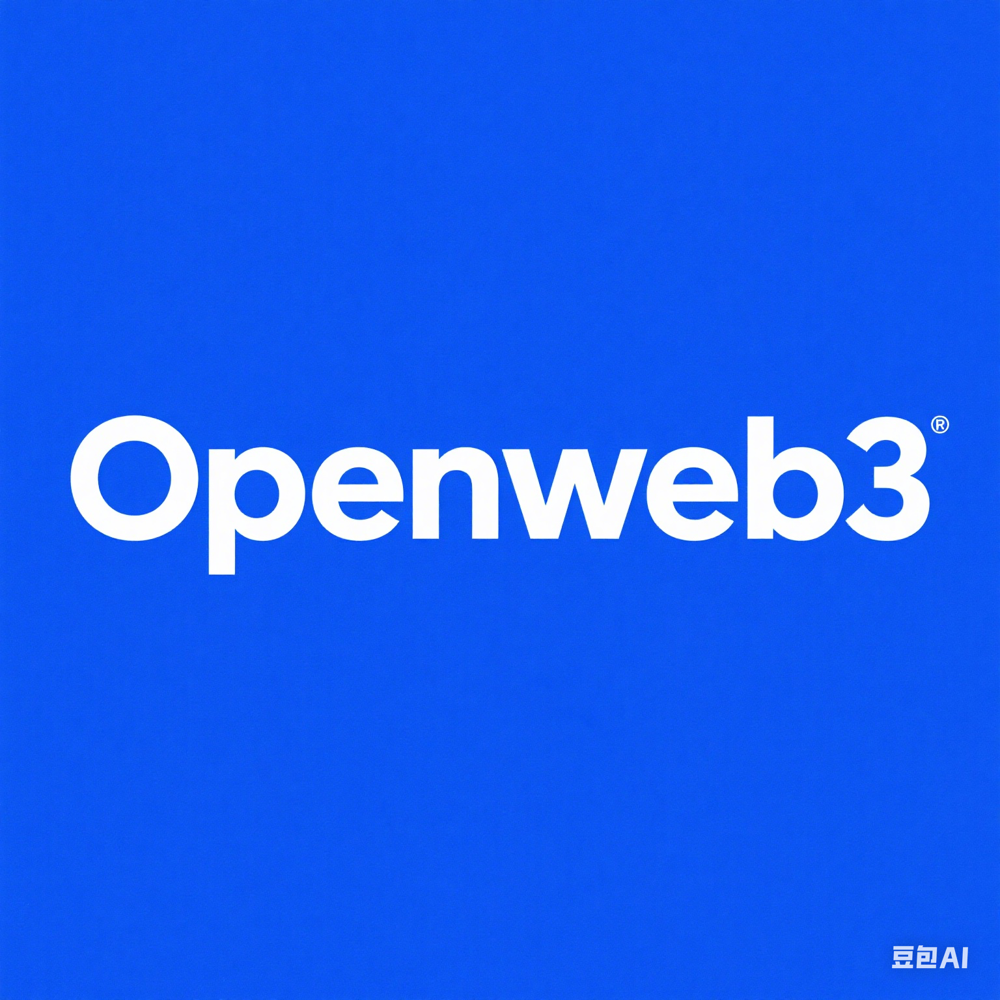

<div align="center" style="margin-bottom: 30px">
  
</div>

# Openweb3 App

> [!CAUTION]
> Openweb3 App is not a production-ready app, but an integration example. It is not feature complete and must be self-hosted.

> [!TIP]
> Questions or issues? Check our [discord](https://discord.gg/H52JTZAtSH) channel for help.

## Overview

Openweb3 App is a payment integration app that allows merchants to accept online payments from customers using Openweb3 as their payment processor. Openweb3 is a popular global payment provider that offers a range of payment methods, including credit cards, bank transfers, and digital wallets.

> [!IMPORTANT]
> To configure the Openweb3 App, you must have an account with [Openweb3](https://docs.openweb3.io/docs/getting-started).

The Openweb3 App allows for integrations with [Openweb3 Payment Element](https://docs.openweb3.io/docs/getting-started), meaning it can be used on [Web, iOS, Android, and React Native](https://docs.openweb3.io/docs/getting-started). Under the hood, it creates Openweb3 [Payment Intents](https://docs.openweb3.io/reference) and handles calculations of total and balance in Saleor automatically.

> [!NOTE]
> Openweb3 App uses Openweb3 API version [2022-11-15](https://docs.openweb3.io/reference).

## Capabilities

The Openweb3 App implements the following [Saleor synchronous events related to transactions](https://docs.saleor.io/docs/3.x/developer/extending/webhooks/synchronous-events/transaction):

- [`PAYMENT_GATEWAY_INITIALIZE_SESSION`](https://docs.saleor.io/docs/3.x/api-reference/webhooks/enums/webhook-event-type-sync-enum#webhookeventtypesyncenumpayment_gateway_initialize_session)
- [`TRANSACTION_INITIALIZE_SESSION`](https://docs.saleor.io/docs/3.x/api-reference/webhooks/enums/webhook-event-type-sync-enum#webhookeventtypesyncenumtransaction_initialize_session)
- [`TRANSACTION_PROCESS_SESSION`](https://docs.saleor.io/docs/3.x/api-reference/webhooks/enums/webhook-event-type-sync-enum#webhookeventtypesyncenumtransaction_process_session)
- [`TRANSACTION_CHARGE_REQUESTED`](https://docs.saleor.io/docs/3.x/api-reference/webhooks/enums/webhook-event-type-sync-enum#webhookeventtypesyncenumtransaction_charge_requested)
- [`TRANSACTION_CANCEL_REQUESTED`](https://docs.saleor.io/docs/3.x/api-reference/webhooks/enums/webhook-event-type-sync-enum#webhookeventtypesyncenumtransaction_cancel_requested)
- [`TRANSACTION_REFUND_REQUESTED`](https://docs.saleor.io/docs/3.x/api-reference/webhooks/enums/webhook-event-type-sync-enum#webhookeventtypesyncenumtransaction_refund_requested)

Furthermore, it's also prepared to handle [Openweb3 incoming webhooks](https://docs.openweb3.io/reference/webhook).

Openweb3 App follows the flow described in detail in the [Saleor Payment App documentation](https://docs.saleor.io/docs/3.x/developer/payments#payment-app).

## Configuration

For Openweb3 to appear as [available payment gateway](https://docs.saleor.io/docs/3.x/developer/checkout/finalizing#listing-available-payment-gateways), you need to [install it in the Saleor Dashboard](https://docs.saleor.io/docs/3.x/developer/app-store/overview#usage). You must obtain the Secret Key and Publishable Key from Openweb3 and paste it into the Openweb3 App configuration form. Webhooks to receive notifications from Openweb3 will be configured automatically.

> [!CAUTION]
> Openweb3 App doesn't work with Restricted Keys.

## Usage in Storefront or mobile apps

Openweb3 App can be used to integrate with Openweb3 APIs. By using a set of GraphQL mutations, one can interact with Openweb3 to authorize, capture, refund, and cancel payments.

### Getting payment gateways

The first step is to fetch the Checkout object including [`availablePaymentGateways`](https://docs.saleor.io/docs/3.x/api-reference/checkout/objects/checkout#checkoutavailablepaymentgatewayspaymentgateway--) field. The `availablePaymentGateways` field contains a list of payment gateways available for given checkout. The Openweb3 App should be one of the payment gateways available in the list. Its `id` is [`app.saleor.openweb3`](https://openweb3.saleor.app/api/manifest) - defined in app's manifest.

```graphql
query {
  checkout(id: "Q2hlY2tvdXQ6YWY3MDJkMGQtMzM0NC00NjMxLTlkNmEtMDk4Yzk1ODhlNmMy") {
    availablePaymentGateways {
      id
      name
    }
  }
}
```

The response:

```json
{
  "data": {
    "checkout": {
      "availablePaymentGateways": [
        {
          "id": "app.saleor.openweb3",
          "name": "Openweb3"
        }
      ]
    }
  }
}
```

> [!NOTE]
> The `availablePaymentGateways` may contain other Payment Apps as well as [legacy plugins](https://docs.saleor.io/docs/3.x/developer/extending/payment-gateways) configured in the Dashboard. You should ignore the ones that you don't want to use for a specific checkout.

### Paying with Openweb3 Payment Element

To initialize the Openweb3 Payment Element, one needs to create a transaction in Saleor by calling the [`transactionInitialize`](https://docs.saleor.io/docs/3.x/api-reference/payments/mutations/transaction-initialize) mutation.

```graphql
mutation Openweb3TransactionInitialize($data: JSON!) {
  transactionInitialize(
    id: "Q2hlY2tvdXQ6YWY3MDJkMGQtMzM0NC00NjMxLTlkNmEtMDk4Yzk1ODhlNmMy"
    amount: 54.24
    paymentGateway: { id: "app.saleor.openweb3", data: $data }
  ) {
    transactionEvent {
      pspReference
      amount {
        amount
        currency
      }
      type
    }
    data
    errors {
      field
      message
      code
    }
  }
}
```

Where `$data` is an object passed to Openweb3 API to create a Payment Intent, for example:

```json
{
  "automatic_payment_methods": {
    "enabled": true
  }
}
```

The mutation returns the `TransactionInitialize` response:

```json
{
  "data": {
    "transactionInitialize": {
      "transactionEvent": {
        "pspReference": "XXXX9XXXXXXXXX99",
        "amount": {
          "amount": 54.24,
          "currency": "EUR"
        },
        "type": "CHARGE_REQUESTED"
      },
      "data": {
        "paymentIntent": {
          "client_secret": "…"
        },
        "publishableKey": "…"
      },
      "errors": []
    }
  }
}
```

`client_secret` and `publishableKey` can be used to initialize the Openweb3 Payment Element.

You can find a working example in this repository: [saleor/example-nextjs-openweb3](https://github.com/saleor/example-nextjs-openweb3/)

### Modifying the payment intent

You can use the [`transactionProcess`](https://docs.saleor.io/docs/3.x/api-reference/payments/mutations/transaction-process) mutation to modify the payment intent. For example:

```graphql
mutation Openweb3TransactionProcess($data: JSON!) {
  transactionProcess(
    id: "Q2hlY2tvdXQ6YWY3MDJkMGQtMzM0NC00NjMxLTlkNmEtMDk4Yzk1ODhlNmMy"
    data: $data
  ) {
    transactionEvent {
      pspReference
      amount {
        amount
        currency
      }
      type
    }
    data
    errors {
      field
      message
      code
    }
  }
}
```

Where `$data` is an object passed to Openweb3 API to edit a Payment Intent, for example:

```json
{
  "automatic_payment_methods": {
    "enabled": true
  }
}
```

### Retrieving publishable key

In some cases, you might want to retrieve just the publishable key without creating any transactions in Saleor. This is particularly useful on a payment summary page where you want to display the details of Openweb3 Payment Intent. To do so, [`paymentGatewayInitialize`](https://docs.saleor.io/docs/3.x/api-reference/payments/mutations/payment-gateway-initialize) mutation can be used:

```graphql
mutation PaymentGatewayInitialize($checkoutId: ID!) {
  paymentGatewayInitialize(
    id: $checkoutId
    amount: 0
    paymentGateways: [{ id: "app.saleor.openweb3" }]
  ) {
    gatewayConfigs {
      id
      data
      errors {
        field
        message
        code
      }
    }
    errors {
      field
      message
      code
    }
  }
}
```

The response:

```json
{
  "data": {
    "paymentGatewayInitialize": {
      "gatewayConfigs": [
        {
          "id": "app.saleor.openweb3",
          "data": {
            "publishableKey": "pk_test_…"
          },
          "errors": []
        }
      ],
      "errors": []
    }
  }
}
```

You can find an example of using the Openweb3 App at [https://docs.openweb3.io/docs/getting-started](https://docs.openweb3.io/docs/getting-started).

## Development

To run the Openweb3 App locally:

1. Go to the app directory.
2. Copy the `.env.example` file to `.env`.The `.env` should contain the following variables:

> [!NOTE]
> Openweb3 App is a Next.js application. If you want to learn more about setting environment variables in Next.js, head over to the [documentation](https://nextjs.org/docs/basic-features/environment-variables).

`SECRET_KEY` (_required_)

A randomly generated key that encrypts metadata stored in Saleor. At least eight characters long.

`APL` (_optional_)

Name of the chosen implementation of the [Authentication Persistence Layer](https://github.com/saleor/saleor-app-sdk/blob/main/docs/apl.md).

When no value is provided, `FileAPL` is used by default. See `saleor-app.ts` in the app directory to see supported APLs.

`APP_DEBUG` (_optional_)

The logging level for the app. The possible values are: `trace`, `debug`, `info`, `warn`, `error`, `fatal`, and `silent`. The default value is `info` which means that some information will be logged into the console.

You can read more about our logger in [its documentation](https://getpino.io/#/docs/api?id=loggerlevel-string-gettersetter).

### Running app in development mode

To run the app in development mode, run the following command:

```bash
pnpm i
pnpm dev
```

<a id="env" style="text-decoration: underline;text-decoration: none;color: inherit;">Environment variables required at runtime<a/>

```shell
# Default field
APP_DEBUG=info
SECRET_KEY=aaaaaaaa

# Dejay miniapp url
DEJAY_MINIAPP_URL=https://t.me/wallet_bot/wallet

# Telegram miniapp url
TELEGRAM_MINIAPP_URL=https://t.me/socialwalletbot/SocialWallet

# Dejay or telegram bot token
TELEGRAM_BOT_TOKEN=7767176546:AAHkxeUHNEES2JIdGhMjPetJjqd_GErKl3c

# Your sales api
SALEOR_API_URL=https://store-.saleoropenweb3.cloud/graphql/

# Saleor dashaboard account and password
SALEOR_ADMIN_EMAIL=openweb3@gmail.com
SALEOR_ADMIN_PASSWORD=openweb3

# Storefont domain
SALEOR_SESSION_DOMAIN=4b86554eee8059fe9598086f48e3feb6.serveo.net

# Generate passwords randomly and do not leak them
SALEOR_USER_PASSWORD=Nm0Cez1Tb3MUGPU2

# Wallet-pay webhook key
WALLET_PAY_WEBHOOK_PUBLIC_KEY=-----BEGIN RSA PUBLIC KEY-----\nMIIBCgKCAQEAw0b7kUY+zoEhqSWdeYfuI0BwORxquDrWhajGJo4o9UzAeP6qAzI0\n272dZWz4XA7zRkO6Z85gRbEym5v76zpm4uqnPWKzXqtmlxzPtQ9w3YmVLWi7ykWt\nJK3ovCTDEXzpv+/EGkgFJaf4fqTXvtrkRPoZIpkMiCDl9kU0BEeutTdCDIljGuJq\n5jI/t0W798HkYnpFrJBU5HxCQzI2YLKUI2jqZ0DihQ7FI9NSoI5xqZZJUuRHzWRw\n9MFQlFnm3CHbcpZLtTBWLDhpG1UVj03YpvzgndasdsadaddedeYrg7oUwVIFA\npLG3d/tSi4d4AjyePHYj/K3WUYWfFV3ChwIDAQAB\n-----END RSA PUBLIC KEY-----

# Proxy email server, Email account password
SMTP_SERVER=gmail
SMTP_USER="openweb3@gmail.com"
SMTP_PASS="openweb3"
```

> [!NOTE]
> pnpm 8.0.0 or higher is required to run the app.

The app will be available at `http://localhost:3000`.

> [!NOTE]
> To test Openweb3 Webhooks, you need to expose your local server to the internet (tunnel). You can use Saleor CLI or Openweb3 CLI to do that. See [this guide](https://docs.saleor.io/docs/3.x/developer/extending/apps/developing-with-tunnels) for more details.

### Running tests

To run tests, one needs to provide additional environment variables. Copy the `.env.test` file to `.env.test.local`.The `.env.test.local` should contain the following variables:

| env variable name       | required?  | description                                                                      | example                                                                                                                            |
| ----------------------- | :--------: | :------------------------------------------------------------------------------- | :--------------------------------------------------------------------------------------------------------------------------------- |
| `TEST_SALEOR_API_URL`   | _required_ | Full URL to the Saleor GraphQL endpoint                                          | `https://saleor.cloud/graphql/`                                                                                                    |
| `TEST_SALEOR_APP_TOKEN` | _required_ | [AppToken](https://docs.saleor.io/docs/3.x/api-reference/apps/objects/app-token) | `3DZ7CbFTyPETthDixPtFpPysoKG4FP`                                                                                                   |
| `TEST_SALEOR_APP_ID`    | _required_ | [App.id](https://docs.saleor.io/docs/3.x/api-reference/apps/objects/app)         | `QXBwOjk=`                                                                                                                         |
| `TEST_SALEOR_JWKS`      | _required_ | stringified JWKS                                                                 | `"{\"keys\": [{\"kty\": \"RSA\", \"key_ops\": [\"verify\"], \"n\": \"...\", \"e\": \"AQAB\", \"use\": \"sig\", \"kid\": \"1\"}]}"` |

Then run the following command:

```bash
pnpm test
```
